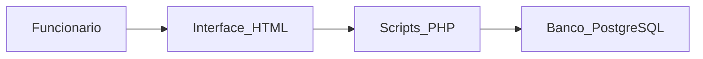
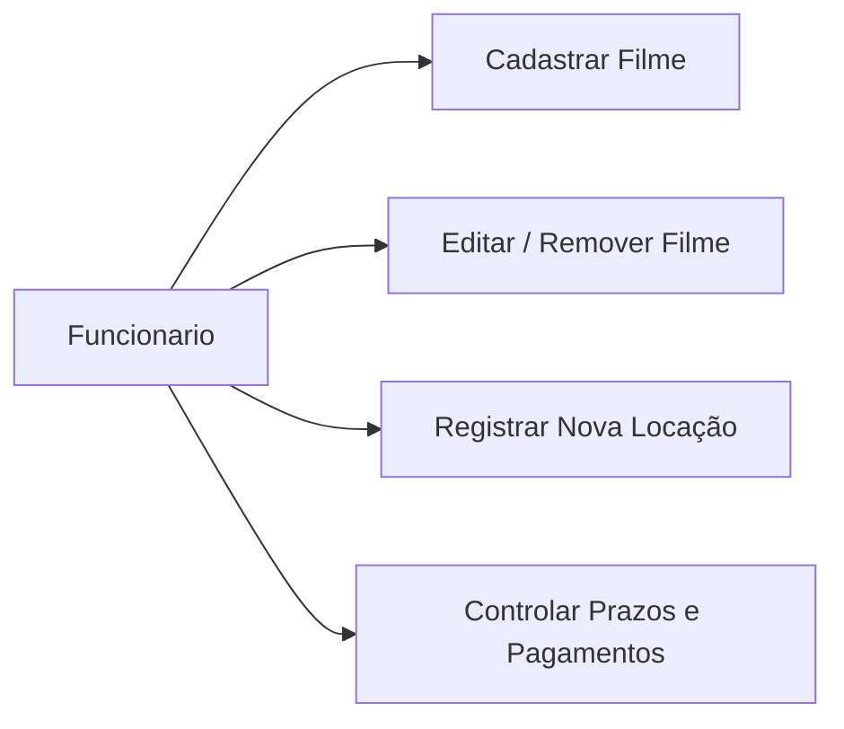
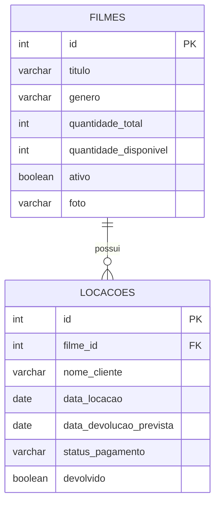
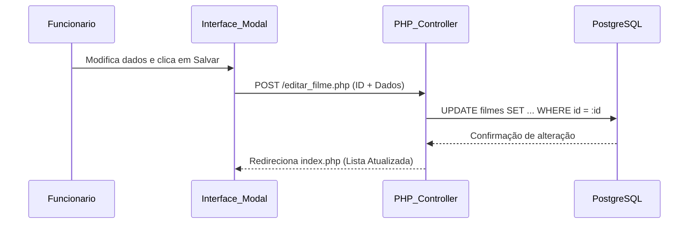
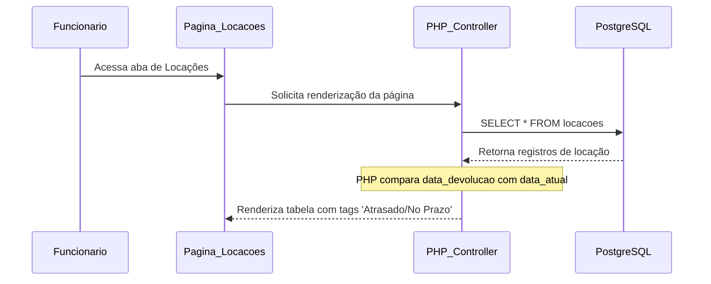
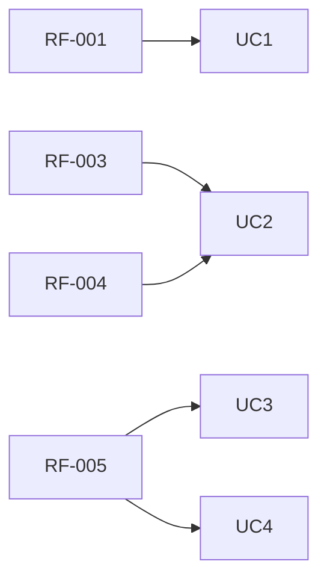

## Sistema de Gestão de Locadora (Que Fita)

**Padrão:** ISO/IEC/IEEE 29148:2018
**Versão:** 1.0.0
**Data:** 2026-05-28
**Autor:** Ana Sofhia Leonardi de Morais

---

## 1. Introdução

### 1.1 Propósito

Este documento descreve os requisitos do sistema **Que Fita**, com objetivo de:

* Definir as funcionalidades do painel administrativo do funcionário;
* Padronizar o entendimento do fluxo de CRUD e controle de locações;
* Servir como guia técnico para a modelagem do banco de dados PostgreSQL e codificação em PHP.

---

### 1.2 Escopo

O sistema consistirá em um painel interno para funcionários que permitirá:

* Gerenciamento completo (CRUD) do catálogo de filmes através de interface dinâmica com modais;
* Controle de locações, devoluções e monitoramento de status de pagamento;
* Verificação automática de atrasos nas devoluções.

O sistema será uma aplicação web estruturada com:

* HTML e CSS para interface;
* JavaScript para manipulação dinâmica de modais e alertas;
* PHP estruturado/funcional para lógica de negócios e processamento;
* PostgreSQL como Sistema Gerenciador de Banco de Dados (SGBD).

---

### 1.3 Definições

| Termo | Definições |
| --- | --- |
| Filme | Item audiovisual disponível para locação no catálogo. |
| Locação | Registro que vincula um filme a um cliente por um período de tempo. |
| Devolução | Ação de retornar o filme físico e atualizar sua disponibilidade no estoque. |
| Soft Delete | Técnica de exclusão lógica onde o dado não é apagado do banco, apenas inativado. |

#### Acrônimos

* **SGL** - Sistema de Gestão de Locadora
* **RF** - Requisito Funcional
* **RNF** - Requisito Não-Funcional
* **PDO** - PHP Data Objects (Camada de conexão segura com o banco)

---

### 1.4 Visão Geral do Documento

Este documento está organizado em:

* Introdução e escopo da aplicação;
* Descrição do sistema do funcionário;
* Requisitos funcionais e não-funcionais detalhados;
* Modelos e diagramas lógicos (Mermaid);
* Regras de negócio da locadora.

---

## 2. Descrição Geral do Sistema

### 2.1 Perspectiva do Sistema

O sistema opera no modelo Cliente-Servidor clássico executado no navegador, onde as requisições PHP processam as informações e persistem diretamente no banco de dados relacional.

---

### 2.2 Funções do Sistema

O sistema deve:

* Cadastrar e listar filmes no catálogo;
* Editar dados e remover filmes via modal de edição;
* Controlar fluxo de locações (vincular cliente ao filme);
* Calcular dinamicamente se uma locação está em atraso;
* Dar baixa em pagamentos e devoluções.

---

### 2.3 Classes de Usuários

| Usuários | Descrição |
| --- | --- |
| Funcionário| Opera o sistema no balcão, gerencia o estoque de filmes e realiza o controle de locações/devoluções de clientes. |

---

## 3. Requisitos do Sistema

### 3.1 Requisitos Funcionais

#### RF-001: Cadastro de Filme (Create)

**Descrição:** Permitir que o funcionário adicione novos filmes ao estoque da locadora.

* **Prioridade:** Alta
* **Versão:** 1.0
* **Rastreabilidade:** Necessidade de gestão de estoque.

---

#### RF-002: Listagem de Catálogo (Read)

**Descrição:** Exibir em formato de grade ou lista todos os filmes ativos na base de dados logo abaixo do formulário de cadastro.

* **Prioridade:** Alta
* **Versão:** 1.0
* **Critérios de Aceitação:**
* Exibir título, gênero e status básico de disponibilidade diretamente na página principal;
* Fornecer um gatilho de clique em cada filme para abertura do modal de gerenciamento.

---

#### RF-003: Edição de Filme via Modal (Update)

**Descrição:** Permitir a alteração de todas as informações de um filme selecionado de dentro de uma janela modal.

* **Prioridade:** Alta
* **Versão:** 1.0
* **Critérios de Aceitação:**
* O modal deve carregar os dados atuais do filme nos campos de input;
* Permitir alteração da quantidade total e quantidade disponível;
* Salvar as alterações diretamente no PostgreSQL e recarregar a visualização.

---

#### RF-004: Remoção de Filme (Delete / Soft Delete)

**Descrição:** Permitir a exclusão ou desativação de um filme do catálogo através do modal de edição.

* **Prioridade:** Alta
* **Versão:** 1.0
* **Critérios de Aceitação:**
* O botão deve disparar um alerta de confirmação em JavaScript antes de enviar o comando ao PHP;
* Utilizar preferencialmente desativação lógica (Soft Delete) para preservar integridade de históricos.

---

#### RF-005: Controle de Locações e Status

**Descrição:** Uma página dedicada para listar as locações correntes, exibindo se estão pagas e calculando atrasos.

* **Prioridade:** Alta
* **Versão:** 1.0
* **Critérios de Aceitação:**
* Listar: Nome do cliente, Filme, Data de Locação e Data de Devolução Prevista;
* Comparar a data atual do servidor com a data de devolução para exibir a tag "No Prazo" ou "Atrasado";
* Disponibilizar ações de atualização para marcar como "Pago" e dar baixa na devolução.

---

### 3.2 Requisitos Não Funcionais

#### RNF-001: Segurança na Camada de Dados

**Descrição:** Todo o processamento de queries SQL no PHP deve utilizar Prepared Statements via PDO para mitigar ataques de SQL Injection.

---

#### RNF-002: Usabilidade (Interfaces Modais)

**Descrição:** A edição e exclusão de itens devem ocorrer sem redirecionamento total de página utilizando janelas modais, otimizando o tempo de operação do atendente.

---

#### RNF-003: Persistência Robusta

**Descrição:** Utilização das restrições de integridade referencial (Foreign Keys) do PostgreSQL para garantir consistência entre as tabelas de filmes e locações.

---

## 4. Regras do Negócio

| Regra | Descrição |
| --- | --- |
| **RN-001** | A quantidade de filmes em estoque e disponíveis nunca pode ser inferior a zero. |
| **RN-002** | Um filme só pode ser alugado se sua `quantidade_disponivel` for maior que zero. |
| **RN-003** | Quando uma locação é registrada, a `quantidade_disponivel` do filme deve decrescer em 1 unidade automática no banco. |
| **RN-004** | Se a data corrente for maior que a `data_devolucao_prevista` e o filme não tiver status de retornado, a situação deve ser computada como "Atrasado". |
| **RN-005** | Um filme vinculado a uma locação ativa não pode sofrer Hard Delete (remoção física do banco), apenas Soft Delete. |

---

## 5. Modelo do Sistema

### 5.1 Diagrama de Casos de Uso

### 5.2 Estrutura do Banco de Dados (Relacional PostgreSQL)

---

### 5.3 Diagramas de Sequência

#### 5.3.1 Atualização de Filme (Update via Modal)

---

#### 5.3.2 Verificação de Status da Locação (Página 2)

---

## 6. Controle de Versão

### 6.1 Histórico de Alterações

| Versões | Data | Autor | Modificação |
| --- | --- | --- | --- |
| 1.0.0 | 2026-05-28 | Ana Sofhia | Criação do projeto|

### 6.2 Rastreabilidade

